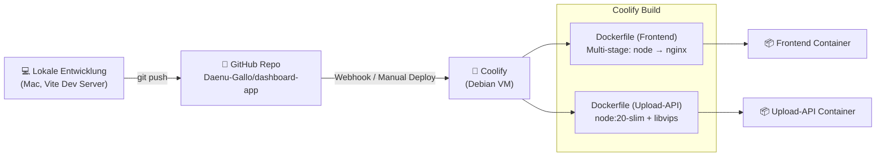

# 📐 Dashboard-App – Detaillierte Topologie

> Stand: 19. März 2026 (v2 – mit Cloudflare Tunnel, SSL & Secrets-Management)

---

## Infrastruktur-Übersicht


---

## Netzwerk & Ports

| Dienst | Interner Port | Öffentlicher Zugang | Wartungs-Zugang | Technologie |
|---|---|---|---|---|
| **Dashboard-App** (Frontend) | `:80` | `https://admin.fotohahn.ch` | `http://debian.orca-mirfak.ts.net` | Nginx + Vite SPA |
| **Kundenansicht** | `:80` | `https://galerie.fotohahn.ch` | – | Nginx (gleicher Container) |
| **Upload-API** | `:3200` | `https://api.fotohahn.ch` | – | Node.js + Express |
| **Supabase (Kong)** | `:3100` | – | Tailscale intern | Kong API Gateway |
| **PostgreSQL** | `:5432` | – | nur intern | PostgreSQL 15 |
| **Supabase Studio** | `:3101` | – | Tailscale intern | Supabase Dashboard |
| **Coolify** | `:8000` | – | Tailscale intern | App-Verwaltung |

> [!IMPORTANT]
> Alle öffentlichen Domains laufen über **Cloudflare Tunnel** (SSL am Edge). Wartungs-Tools sind **nur via Tailscale VPN** erreichbar.

---

## Frontend-Architektur


### Seitenstruktur

| Seite | Datei | Beschreibung |
|---|---|---|
| **Dashboard** | `DashboardPage.jsx` | Übersicht, Statistiken, Recharts-Diagramme |
| **Galerien** | `GalleriesPage.jsx` | Liste aller Galerien (CRUD) |
| **Galerie-Detail** | `GalleryDetailPage.jsx` | Tabs: Bilder, Einstellungen, Design, Verschicken, Statistiken, Auswahlen, Shop |
| **Kundenansicht** | `CustomerView.jsx` | Öffentliche Galerie-Ansicht für Endkunden |
| **Portfolios** | `PortfoliosPage.jsx` | Portfolio-Verwaltung |
| **Einstellungen** | `SettingsPage.jsx` | Globale Benutzereinstellungen, Branding |
| **Login/Register** | `LoginPage.jsx`, `RegisterPage.jsx` | Authentifizierung über Supabase GoTrue |
| **Rechtliches** | `LegalPage.jsx` | Impressum, Datenschutz, AGB |

### Galerie-Detail Tabs

| Tab | Datei | Funktion |
|---|---|---|
| Bilder | `BilderTab.jsx` (55 KB) | Bild-Upload, Thumbnails, Drag & Drop, Titelbilder |
| Einstellungen | `EinstellungenTab.jsx` | Album-Einstellungen, Passwort, Ablaufdatum |
| Design | `DesignTab.jsx` | Farben, Layout, Wasserzeichen |
| Verschicken | `VerschickenTab.jsx` | QR-Code, Link teilen, E-Mail |
| Statistiken | `StatistikenTab.jsx` | Aufrufe, Besucher |
| Auswahlen | `AuswahlenTab.jsx` | Kundenauswahl der Favoriten |
| Shop | `ShopTab.jsx` | Shop-Funktionalität (in Entwicklung) |

### Layout-Komponenten

| Komponente | Beschreibung |
|---|---|
| `MainLayout.jsx` | Wrapper mit Sidebar + Content-Bereich |
| `Sidebar.jsx` | Seitliche Navigation |
| `Topbar.jsx` | Obere Leiste mit Suche, Benachrichtigungen, Profil |
| `AnnouncementBanner.jsx` | Info-Banner |
| `CookieConsent.jsx` | DSGVO Cookie-Consent |
| `ErrorBoundary.jsx` | React Error Boundary |
| `LazyImage.jsx` | Lazy-Loading für Bilder |

---

## Custom Hooks

| Hook | Zweck |
|---|---|
| `useGalleryImages.js` | Bilder laden/verwalten pro Galerie (Upload-API) |
| `useSupabaseSetting.js` | Key-Value Settings aus `user_settings` Tabelle |
| `usePersistedState.js` | State mit LocalStorage-Persistenz |
| `useBrandFavicon.js` | Dynamisches Favicon basierend auf Branding |
| `useMetaTags.js` | Dynamische Meta-Tags (SEO) |
| `useTrackView.js` | Galerie-Aufrufe tracken |
| `useKeyboardShortcuts.js` | Globale Tastaturkürzel |
| `useVersionCheck.js` | Versions-Prüfung |

---

## Context-Providers

| Context | Datei | Verantwortung |
|---|---|---|
| `AuthContext` | `AuthContext.jsx` | Benutzer-Session, Login/Logout (Supabase Auth) |
| `BrandContext` | `BrandContext.jsx` | Branding-Einstellungen (Logo, Farben) |
| `GalleryContext` | `GalleryContext.jsx` | Galerie-Daten, CRUD-Operationen |
| `ToastContext` | `ToastContext.jsx` | Benachrichtigungs-Toasts |

---

## Upload-API (Backend)

*(Upload-API Endpoints – siehe Tabelle unten)*

### API Endpoints

| Method | Route | Auth | Beschreibung |
|---|---|---|---|
| `POST` | `/api/upload/:galleryId/:albumIndex` | ✅ JWT | Bilder hochladen (max. 100, 50 MB/Datei) |
| `GET` | `/api/images/:userId/:slug/:albumIndex/:type/:filename` | ❌ | Bilder ausliefern (`original` / `thumb`) |
| `DELETE` | `/api/images/:imageId` | ✅ JWT | Bild löschen (NAS + DB) |
| `PATCH` | `/api/images/:imageId` | ✅ JWT | Flags setzen (Titelbild, Mobile, App-Icon) |
| `PUT` | `/api/images/reorder` | ✅ JWT | Sortierreihenfolge ändern |
| `GET` | `/api/health` | ❌ | Health Check (NAS, Supabase Status) |

### NAS-Dateistruktur

```
/mnt/nas/onlinegalerie/
└── {user_id}/
    └── {gallery_slug}/
        └── {album_index}/
            ├── original/
            │   └── foto_abc123.jpg      ← Sharp JPEG 92%
            └── thumb/
                └── thumb_foto_abc123.jpg ← Sharp 400px wide, JPEG 80%
```

---

## Datenbank-Schema (Supabase PostgreSQL)


### Row Level Security (RLS)

| Tabelle | Policy | Regel |
|---|---|---|
| `images` | Users manage own images | `auth.uid() = user_id` (CRUD) |
| `images` | Public read images | alle dürfen lesen (Kundenansicht) |
| `gallery_views` | Anyone can insert | anonyme Besucher dürfen einfügen |
| `gallery_views` | Owner can read | nur Galerie-Besitzer kann lesen |
| `portfolios` | Users manage own | `user_id = auth.uid()` (CRUD) |
| `user_settings` | Users manage own | `user_id = auth.uid()` (CRUD) |

---

## Auth-Flow


---

## Deployment-Pipeline



---

## Technologie-Stack

| Schicht | Technologie | Version |
|---|---|---|
| **Frontend-Framework** | React | 19.2.4 |
| **Build Tool** | Vite | 8.0.0 |
| **Routing** | React Router DOM | 7.13.1 |
| **UI Icons** | Lucide React | 0.577.0 |
| **Charts** | Recharts | 3.8.0 |
| **QR-Code** | qrcode.react | 4.2.0 |
| **ZIP** | JSZip | 3.10.1 |
| **Backend** | Express.js | 4.21.0 |
| **Bildverarbeitung** | Sharp | 0.33.2 |
| **Upload** | Multer | 1.4.5 |
| **Datenbank** | PostgreSQL (via Supabase) | 15 |
| **Auth** | Supabase GoTrue | – |
| **API Gateway** | Kong | – |
| **Webserver** | Nginx Alpine | – |
| **Container** | Docker (via Coolify) | – |
| **Tunnel** | Cloudflare Tunnel (cloudflared) | – |
| **DNS** | Cloudflare | – |
| **Node.js** | Node.js | 22 (FE) / 20 (API) |

---

## Domains & DNS

### Öffentlich (via Cloudflare Tunnel, SSL inklusive)

| Domain | Ziel | Zweck | Status |
|---|---|---|---|
| `https://galerie.fotohahn.ch` | Dashboard-App (Coolify) | Kundenansicht – Kunden sehen Foto-Galerien | ✅ Aktiv |
| `https://admin.fotohahn.ch` | Dashboard-App (Coolify) | Admin-Dashboard – Galerien verwalten | ✅ Aktiv |
| `https://api.fotohahn.ch` | Upload-API (Coolify) | Bilder hochladen/ausliefern | ✅ Aktiv |
| `fotohahn.ch` | Hauptseite (Scrappbook/Heroku) | Firmenseite | ✅ Aktiv |

### Wartung (nur Tailscale VPN)

| Adresse | Zweck |
|---|---|
| `http://debian.orca-mirfak.ts.net` | Dashboard-App (Wartung) |
| `http://debian.orca-mirfak.ts.net:8000` | Coolify (Deployment-Verwaltung) |
| `http://debian.orca-mirfak.ts.net:3101` | Supabase Studio (Datenbank) |

> [!NOTE]
> SSL wird durch Cloudflare am Edge terminiert. Der Tunnel zum Server ist ebenfalls verschlüsselt. Kein separates Let's Encrypt nötig.

---

## Externe Anbieter & Drittdienste


| Anbieter | Zweck | Integration | Status |
|---|---|---|---|
| **GitHub** | Source Code Repository | `daenu-gallo/dashboard-app` → Coolify Webhook | ✅ Aktiv |
| **Cloudflare** | DNS + Tunnel + SSL (Edge) | `cloudflared` Daemon auf Debian VM. Tunnel-Routes: `admin`, `galerie`, `api`, `db` | ✅ Aktiv |
| **Tailscale** | VPN (Admin-Zugang zu Coolify/Supabase) | `debian.orca-mirfak.ts.net` | ✅ Aktiv |
| **Coolify** | Container Orchestration (PaaS) | Auf Debian VM, Traefik als Proxy | ✅ Aktiv |
| **Google Analytics** | Websitestatistiken | `CookieConsent.jsx` + GA-Code in Settings | ✅ Integriert |
| **Google Tag Manager** | Tag-Management | GTM-ID konfigurierbar in Settings | ✅ Integriert |
| **Google Ads** | Werbung / Conversion Tracking | via Cookie Consent | ✅ Integriert |
| **Google Fonts** | Schriften (Inter, Open Sans, Roboto) | `index.css` + dynamisch in `CustomerView` | ✅ Aktiv |
| **Facebook Pixel** | Marketing-Tracking | via Cookie Consent | ✅ Integriert |
| **Resend** | Transaktionale E-Mails (Galerie-Links) | API-Integration | 🔧 Geplant |
| **Synology NAS** | Hardware-Host für VM + Foto-Speicher | Debian VM + NAS Mount | ✅ Aktiv |
| **Heroku** | Hosting für fotohahn.ch (Scrappbook) | Separates Deployment | ✅ Aktiv |

---

## 🛡️ Sicherheitsbewertung (0–100%)


### Bewertung im Detail

#### ✅ Externe Anbieter (90–95%)

| System | Score | Bewertung |
|---|---|---|
| **Cloudflare** | 🟢 95% | Enterprise-DDoS-Schutz, WAF, Tunnel-Verschlüsselung (TLS), SSL am Edge |
| **Tailscale** | 🟢 95% | WireGuard-basiertes VPN, Zero-Trust-Netzwerk. Admin-Zugang nur für autorisierte Geräte |
| **GitHub** | 🟢 90% | 2FA verfügbar, Dependabot Alerts. ✅ Keine Secrets mehr im Repo |
| **Google Services** | 🟢 90% | Enterprise-Sicherheit, DSGVO-konformes Consent über `CookieConsent.jsx` |

#### ✅ Eigene Infrastruktur (70–90%)

| System | Score | Bewertung |
|---|---|---|
| **SSL / HTTPS** | 🟢 90% | ✅ Cloudflare SSL am Edge, verschlüsselter Tunnel, HTTPS erzwungen |
| **Secrets Management** | 🟢 85% | ✅ Keine Secrets in Git. Alle Secrets via Coolify Env Vars. Sensitive Docs nur lokal |
| **Upload-API** | 🟢 80% | ✅ Helmet, CORS eingeschränkt, Rate Limiting (100/15min + 20/15min Uploads), JWT-Auth |
| **NAS Speicher** | 🟢 80% | ✅ Passwort-Gate auf Galerie (wie Scrappbook). Bild-URLs schwer erratbar (UUID). Bewusster Design-Entscheid für Handy-Shortcuts |
| **Kong API Gateway** | 🟢 85% | ✅ Deklarative YAML-Config, Keys via Coolify Env Vars persistent. Automatisch bei Redeploy |
| **Supabase Auth** | 🟢 80% | JWT-basierte Auth, Token-Validierung via GoTrue |
| **PostgreSQL + RLS** | 🟢 80% | Row Level Security aktiv auf allen Tabellen |
| **Nginx Frontend** | 🟢 80% | ✅ Security Headers + CSP via Nginx. HSTS via Cloudflare Edge (nicht Nginx wegen self-hosted Supabase) |
| **Coolify** | 🟡 70% | Container-Isolation, Traefik-Proxy |

> [!NOTE]
> **Gesamt-Score: ~85%** — Deutliche Verbesserung gegenüber dem Ausgangszustand (~55%). Alle kritischen Punkte sind behoben.

### 📋 Verbleibende Massnahmen

| Prio | Massnahme | Aufwand | Wirkung |
|---|---|---|---|
| 🟢 1 | **Key Rotation** Strategie definieren | 30 Min | Regelmässige Key-Updates |

